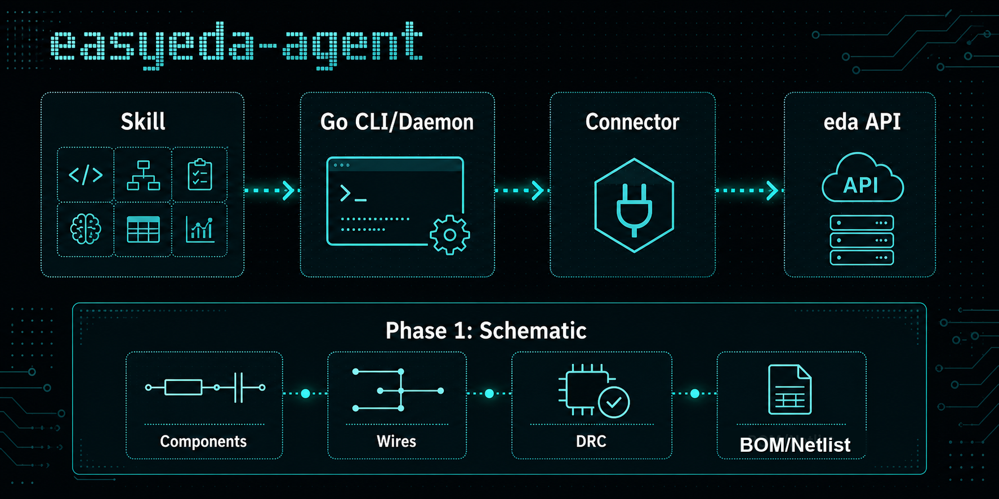

<p align="center">
  
</p>

<h1 align="center">easyeda-agent</h1>

<p align="center">
  AI-native automation layer for EasyEDA.
</p>



`easyeda-agent` turns the official EasyEDA extension API into a typed, observable, Skill-friendly system. The EasyEDA plugin stays thin: it connects to the local agent and executes approved actions. The Go CLI/daemon owns protocol, state, artifacts, validation, and user-facing workflows.

## Why This Exists

The upstream `run-api-gateway` proves the important entry point: code can run inside EasyEDA with access to the official `eda` object. Its rough edge is that it exposes raw JavaScript execution as the main workflow. That is powerful, but brittle for agents.

The connector is real and working: it port-scans `49620-49629`, validates a handshake, self-heals its connection, and dispatches **20 typed actions** to the official `eda.*` API. Raw JS survives only as the confirmation-gated `debug.exec_js` escape hatch. See [docs/FEATURES.md](docs/FEATURES.md) for the full feature/roadmap inventory.

This project moves the system into a better shape:

- Skill describes expert workflow and guardrails.
- Go CLI/daemon exposes stable typed actions.
- EasyEDA connector plugin only bridges to official `eda.*` APIs.
- Artifacts, screenshots, DRC results, and audit logs are first-class outputs.

## Phase 1 Scope

Phase 1 focuses on schematic workflows:

- connect to an active EasyEDA window
- read project and current document context
- list schematic pages
- search the EasyEDA device library and place real LCSC / 立创 parts by identity
- list, place, modify, and delete schematic components
- create wires, net labels, ports, power flags, and ground flags
- `connect_pin` — draw a stub wire out of a pin and place a netflag at its far end in one call (avoids the "flag overlaps pin" DRC fatal)
- select and inspect primitives
- run schematic DRC
- save schematic changes
- export schematic netlist and BOM artifacts
- capture schematic viewport snapshots for verification

A data-only [schematic linter](skills/easyeda-schematic/scripts/README.md) finds layout and
connectivity problems from primitive data (no screenshots), with a diff baseline.

PCB, footprint, manufacturing, and library authoring are intentionally deferred.
A roadmap (standard-parts library, optimized search, LCSC mall comparison) lives
in [docs/FEATURES.md](docs/FEATURES.md).

## Demo Examples

Boards driven end-to-end through the typed-action + Skill workflow — placed
**entirely from real LCSC / 立创 library parts** (search → place by uuid → wire →
flag → DRC), not hand-drawn symbols. Layout follows the
[auto-layout SOP](skills/easyeda-conventions/references/auto-layout-sop.md) distilled
from a 嘉立创 reference design: **flags only on power/ground rails; signals are real
local orthogonal wires; decoupling hugs each IC's VCC pad; multi-page by function.**

> 截图(原理图 + PCB 布局)随后补充到每个示例下。Schematic + PCB-layout screenshots
> for each example will be added below.

### 1. ESP32-S3-WROOM-1 minimal system board
ESP32-S3 module + decoupling + USB-C + 3V3 LDO + boot/reset. Library-first, lint-clean.

<!--   -->
*原理图 / PCB 截图:待补充 (TBD)*

### 2. USB-C + AMS1117-3.3 power board
USB-C input → AMS1117-3.3 LDO rail with input/output decoupling. Library-first, lint-clean.

<!--   -->
*原理图 / PCB 截图:待补充 (TBD)*

### 3. motobox2026 — ESP32-S3 · 4G · GNSS · IMU tracker (≈110 parts, 3 pages)
A larger multi-page board: ESP32-S3 + Air780EG (4G) + LC29H (GNSS) + LSM6DSV16X (IMU)
+ SD-NAND + multi-rail power (buck / charger / LDOs) + USB. Realized across **3 A4 pages**
(Power / MCU+Digital / RF+4G) with cross-page net ports; layout refined SOP-by-SOP
(W wire → F rail-flag → D decouple → C cluster → N net-classify → G multipage). WIP.

<!--   -->
*原理图 / PCB 截图:待补充 (TBD)*

## Repository Layout

```text
cmd/easyeda/                 CLI entrypoint used by humans and Skills
internal/app/                CLI command implementation
internal/daemon/             Local daemon: /health, /eda (connector WS), /action
internal/protocol/           Typed action protocol shared with connector (actions.go)
internal/version/            Build/version metadata
extension/                   EasyEDA connector (.eext) source + build (TypeScript → esbuild)
skills/easyeda-schematic/scripts/        Data-only schematic linter + rule-trust harness + diff baseline
skills/easyeda-schematic/    The user-facing Skill
docs/                        Architecture, protocol, features/roadmap, conventions, decisions
```

## Current Commands

```bash
go run ./cmd/easyeda version
go run ./cmd/easyeda phase1
go run ./cmd/easyeda actions
go run ./cmd/easyeda daemon
go run ./cmd/easyeda health
go run ./cmd/easyeda call system.health
```

`daemon` starts the local server. It binds the first free port in `127.0.0.1:49620-49629` and serves three endpoints, then runs until interrupted (Ctrl-C / SIGTERM):

- `GET /health` — service identity, version, and connected windows
- `GET /eda` — WebSocket the EasyEDA connector registers on (daemon sends a `handshake` on connect)
- `POST /action` — a typed action envelope to forward to a connected window

`health` scans the same port range for an `easyeda-agent` daemon. With the daemon running it reports `status: found` and lists connected windows; otherwise a clean `not_found` result is expected.

`call <action>` finds the running daemon and posts a typed action to it. `system.health` is answered by the daemon itself (no connector required); schematic actions need a connected EasyEDA window and return `NO_CONNECTOR` until the connector extension is running.

Both sides of the action protocol are in place and working. The Go daemon owns the protocol, state, artifacts, and validation; the EasyEDA connector under `extension/` is a buildable `.eext` that dispatches the 20 typed actions to live `eda.*` calls (type-checked against `@jlceda/pro-api-types`). See [extension/README.md](extension/README.md).

## Design Position

Raw JavaScript execution remains useful for debugging, but not as the primary AI surface. The default surface should be typed actions with explicit inputs, predictable outputs, artifact handling, and verification hooks.

See:

- [Phase 1 schematic scope](docs/phase-1-schematic.md)
- [Phase 2 PCB layout/routing feasibility](docs/phase-2-pcb.md)
- [Architecture](docs/architecture.md)
- [Protocol](docs/protocol.md)
- [Skill design](docs/skill-design.md)
