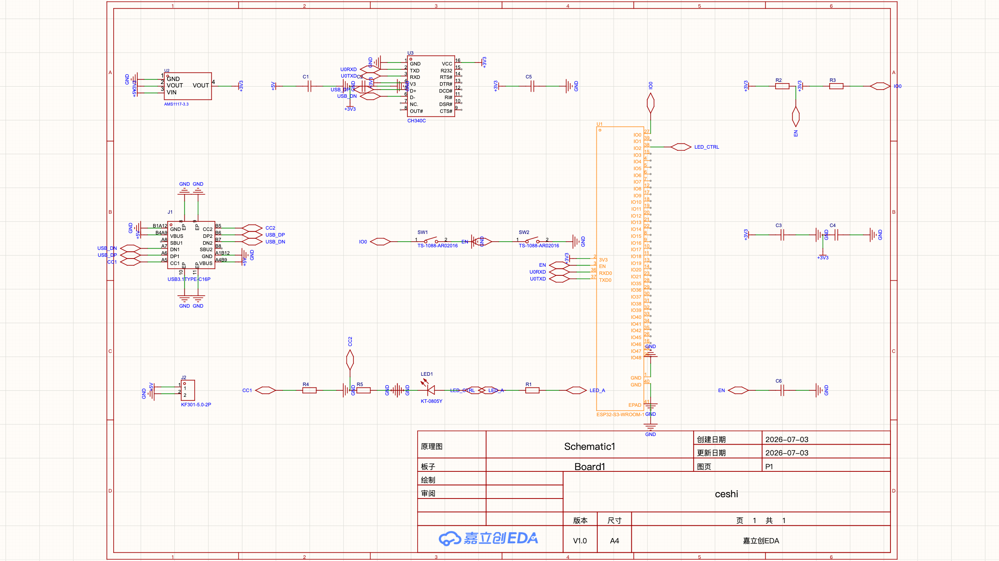
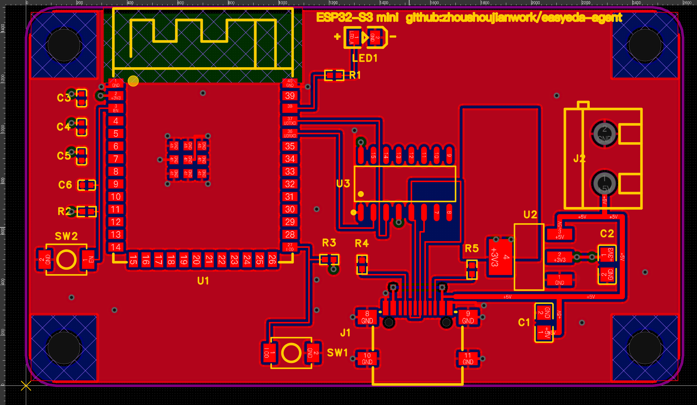

# 实战案例:一份需求文档 → AI 全自动画完 ESP32-S3 四层板

> **输入**是一份 30 行的中文需求([`esp32MiniRequire.md`](../esp32MiniRequire.md)),
> **输出**是一块过了 DRC 的四层板:原理图 19 器件 13 网络、PCB 布局评审 + 布线 + 内电层 +
> 铺铜 + 丝印,全程由 [easyeda-agent](https://github.com/zhoushoujianwork/easyeda-agent)
> 驱动 EasyEDA Pro 完成,人只做了两件事:把 EasyEDA 切到前台、目检确认。

## 需求 → 交付

| 需求原文 | 交付 |
|---|---|
| 4 层板;2 层接地;1 内电层;1 VCC 电源层 | L1 信号+GND 铺铜 / **L15 GND 内电层(PLANE)** / **L16 +3V3 电源层** / L2 GND 铺铜 |
| 5V 端子 + USB 双路供电,降压 3.3V | KF301-5.0-2P + USB-C 共 +5V 一路 → AMS1117-3.3 |
| CH340 插 USB 即烧录 | CH340C(内置晶振),USB 差分对**零过孔**布线,UART 走廊零交叉 |
| BOOT + RESET 按键 | SW1/SW2 带 10k 上拉 + EN 复位 RC,均贴板边可按 |
| LED 点灯 + 极性丝印 | GPIO2 → 330R → LED,丝印 **+ / −** 就位 |
| 四角 M3 螺丝孔 | Ø3.2 挖槽 ×4,四角对称,带禁铜环 |
| 电气规范 / 信号完整性 / 散热 | 天线区**每层**禁铜、去耦贴电源脚、AMS1117 tab 3V3 散热铜、DRC 归零 |

## 最终指标(全部机械可验,非肉眼)

```
sch  drc          0 fatal / 0 error(3 warn = 有意备用脚)
sch  连通性        13 网络 64 引脚 100% 对齐设计意图
pcb  drc          Connection 0 · Clearance 0
pcb  check        0 findings(DFM: 丝印/锐角/悬铜/天线禁铜逐项过)
pcb  layout-lint  100/100(0 覆盖 / 0 出板 / 0 ratsnest 交叉)
BOM               13 行全带 LCSC C 号,直接可下单
```

## 截图(原生 EasyEDA 截图,非数据渲染)

**原理图**(库优先选型,`sch autoconnect` 批量落 64 个网络标志):



**PCB 终态**(左上天线禁铜区、四角对称 M3、右侧电源链、底边 USB-C):



## 流程亮点

1. **多智能体布局评审**:3 个不同侧重(信号流 / 装配人机 / EMC电源)的 AI 设计师并行出布局方案,
   全部先过**确定性几何校验器**(装配间隙≥40mil、去耦贴脚、按键贴边、天线净空、M3 避让、
   USB 扇出通道预留),再经对抗评审 + 裁判合成 —— 胜出方案 2600×1500mil,ratsnest 最短。
2. **布线是推演出来的,不是试出来的**:USB 差分对经交叉奇偶性分析做到零过孔;UART 用
   「外绕拐角」拓扑零交叉;+5V 双 VBUS 合并是全板唯一一处换层桥。
3. **DRC 归零是 5 轮数据闭环**:Connection 50→17→6→5→3→**0**,Clearance 26→**0**。
   每轮从 DRC 明细坐标反推根因,过程中实证了 3 个官方 API 平台问题并已提交 issue:
   [pro-api-sdk#31](https://github.com/easyeda/pro-api-sdk/issues/31)(track↔via 连通性)、
   [#32](https://github.com/easyeda/pro-api-sdk/issues/32)(PLANE anti-pad)、
   [#33](https://github.com/easyeda/pro-api-sdk/issues/33)(pad number 读回)。
   完整缺口清单与闭环路线见 [`optimization-loop.md`](./optimization-loop.md)。

## 自己跑一遍

```bash
# 安装 CLI + 连接器(EasyEDA Pro 开启「允许外部交互」)
curl -fsSL https://raw.githubusercontent.com/zhoushoujianwork/easyeda-agent/main/install.sh | sh

# 核心命令一览
easyeda daemon health                 # 连上了吗
easyeda sch place / autoconnect       # 放器件、批量连网络
easyeda pcb auto-place / route-short  # 布局种子、短线自布
easyeda pcb power-planes / pour-fit   # 4层电源分配、铺铜
easyeda pcb drc / check / layout-lint # 三重门禁
```

> 测试工程用一次性 `ceshi`;本案例的阶段数据包在 `rec/showcase-final/`
> (截图 + components/tracks/vias/pours/nets/drc JSON 快照)。
